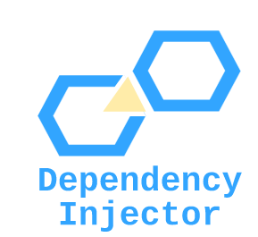

# Dependency-injection-app

Simple FastAPI application that implement dependency injection concept.
It uses Dependency injector library.
App uses SQLite database and SQLALchemy library for model/db mapping.




Purpose of use DI in dynamically typed language like Python is in doubt.
In complex application it may bring some flexibility and clarity to the app architecture.
Due to its simplicity, the following example has an overview role.


## Run the application

**With docker **:

Download the repo locally

Run project in development environment
```
docker-compose up
```

Run localhost:5000 (port assinged in docker compose file) and try out the endpoints:

```
/users
/users/{id}
/items
```

They return list of object saved as far in database.
